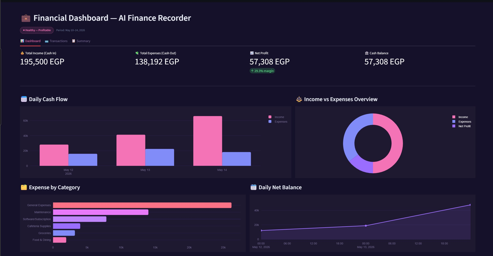

# Exology AI Finance Recorder & Accounting Dashboard



> Record any business transaction by sending a message. That's it.

Exology is a lightweight, AI-powered financial tracking system built for small and medium business owners. Send a text, voice note, or receipt photo to a Telegram bot the system extracts structured data, stores it, and keeps you informed with weekly health reports and cash drought alerts.

---

## How It Works

```
Telegram (text / voice / photo)
        ↓
   n8n Workflow Engine
        ↓
  Gemini 2.5 Flash API   ←  understands Arabic & English
        ↓
   Google Sheets DB
        ↓
Telegram confirmation + weekly reports + alerts
```

Three independent workflows handle everything automatically:

| Workflow | Trigger | What It Does |
|---|---|---|
| **Exology (Main)** | Incoming Telegram message | Records transactions from text, voice, or photo |
| **Exology – Forecasting** | Daily at 11:00 PM | Projects 30-day cash flow; alerts on negative balance |
| **Exology – Health Score** | Every Monday at 9:00 AM | AI CFO analysis with health score and recommendations |

---

## Features

- **Multi-modal input** text, voice notes (.ogg), and receipt photos via Telegram
- **Bilingual** Arabic and English processed natively by Gemini 2.5 Flash
- **Auto-categorization** maps transactions to your Chart of Accounts automatically
- **Data validation** enforces amount, currency, and confidence rules before saving
- **30-day forecasting** projects income, expenses, and balance from 90-day history
- **Cash drought alerts** proactive Telegram message when projected balance turns negative
- **Weekly health score** AI-generated CFO report: Healthy / Warning / Critical
- **Google Sheets database** all data stored in structured, accessible spreadsheets

---

## Prerequisites

- [n8n](https://n8n.io) instance (self-hosted or cloud) v1.0+
- Telegram Bot Token create one via [@BotFather](https://t.me/BotFather)
- Google account with Google Sheets API enabled
- [Gemini API Key](https://aistudio.google.com) free tier available

---

## Setup

### 1 Create n8n Credentials

In your n8n dashboard, go to **Credentials → New** and add:

- **Telegram API** paste your Bot Token from @BotFather. Name it `Exology Bot`.
- **Google Sheets OAuth2** authorize with your Google account. Name it `Exology Sheets`.

The Gemini API key is embedded directly in the HTTP Request nodes as a URL query parameter. No separate credential needed just replace the placeholder key with your own in all three workflows.

### 2 Set Up Google Sheets

Create a new Google Spreadsheet with these three sheets (tabs):

**Transactions**
```
transaction_id | timestamp | type | amount | currency | category |
payment_method | description | vendor | account_code | account_name |
account_type | confidence_score | input_type | raw_input
```

**Forecasts**
```
forecast_date | projected_income | predicted_expenses |
predicted_balance | cash_drought | generated_at
```

**Health_Scores**
```
health_score | summary | recommendation_1 |
recommendation_2 | recommendation_3 | generated_at
```

### 3 Import the Workflows

1. Open your n8n dashboard and click **New Workflow**
2. Click the three-dot menu `⋮` → **Import from File**
3. Import each file one at a time:
   - `Exology.json`
   - `Exology - Forecasting.json`
   - `Exology - Health Score.json`

### 4 Update References

Inside each imported workflow:

- Replace all credential references with your own `Exology Bot` and `Exology Sheets` credentials
- Replace the Google Sheets document ID `119LsTEEgaJfmMETDke7P_0ldZBZgAx1l3l_2w-WXJq4` with your own spreadsheet ID (found in the sheet URL)
- Replace the Gemini API key in all HTTP Request nodes with your own key

### 5 Activate

Toggle each workflow to **Active**. The main workflow starts listening for Telegram messages immediately.

---

## Data Validation Rules

| Scenario | Behavior |
|---|---|
| Missing amount | Transaction rejected |
| Missing timestamp | Auto-filled with current date/time |
| Missing currency | Defaults to EGP |
| Confidence score < 0.6 | Saved with Pending status; user alerted |
| AI parse error | `{ error: true, raw_response }` saved; user notified |
| Missing JSON structure | Regex fallback attempts to extract embedded JSON |

---

## Forecasting Logic

Every night, the forecasting workflow filters the last 90 days of transactions and projects forward 30 days:

```js
const avgDailyIncome  = totalIncome  / 90;
const avgDailyExpense = totalExpense / 90;
const avgDailyNet     = avgDailyIncome - avgDailyExpense;

// For each of the next 30 days:
projected_income:  avgDailyIncome  * i,
projected_expense: avgDailyExpense * i,
projected_balance: avgDailyNet     * i,
cash_drought:      avgDailyNet < 0   // alert fires if true
```

If `cash_drought` is true on any projected day, a Telegram alert is sent immediately.

---

## Known Limitations

- No confirmation step before saving transactions are written immediately after extraction
- Gemini free tier has rate limits; high-volume usage may cause delays
- Only `.ogg` voice format (Telegram default) is tested
- No duplicate detection the same message can be recorded twice
- Hardcoded single Telegram chat ID multi-user support requires additional routing logic
- No built-in transaction editing; corrections require direct Sheets access

---

## Roadmap

**Short-term**
- Confirmation keyboard (Yes / Edit / Cancel) before saving
- Fixed category taxonomy enforced at prompt level
- Duplicate detection via message hashing

**Medium-term**
- Multi-user support with per-user Sheets routing
- PDF receipt support via Gemini document understanding
- Monthly auto-generated financial statements

**Long-term**
- Web dashboard with charts and filters
- Budget tracking with category-level alerts
- QuickBooks / Xero / Wave integration
- Dedicated mobile app

---

## File Structure

```
├── Exology.json                          # Main transaction recording workflow
├── Exology - Forecasting.json            # Daily forecasting + cash drought alert
├── Exology - Health Score.json           # Weekly AI CFO health report
└── README.md
```

---

## Built With

- [n8n](https://n8n.io) workflow automation
- [Gemini 2.5 Flash](https://aistudio.google.com) AI extraction and analysis
- [Telegram Bot API](https://core.telegram.org/bots/api) user interface
- Google Sheets database and dashboard

---

## Contact

**Exology – Smart Solutions & Consulting**  
hi@exology.co
